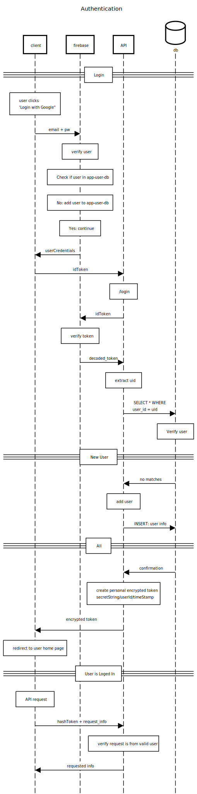
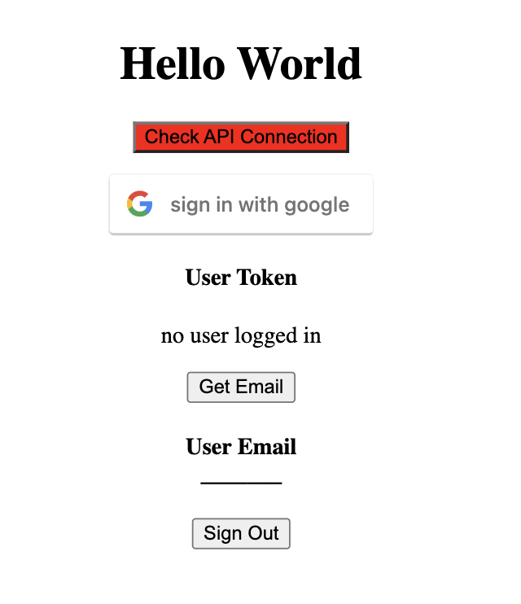
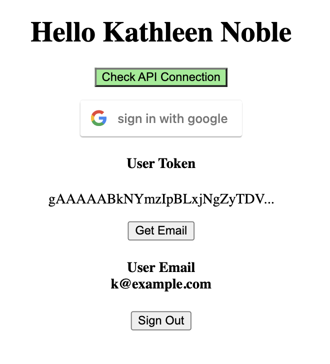

# React + FastAPI Authentication with Firebase

This is a simple web app with a React client and FastAPI server that uses Firebase to authenticate users via 'Sign in with Google'

This web application generates encrypted session tokens within the FastAPI server. This eliminates the need to authenticate API requests with Firebase or a related database when those requests are coming from a user who is logged in.

Flow chart: Authentication Chain

App when signed out

<!--  -->

App when API connection checked and active, user logged in, email requested

<!--  -->

## Commands to Run Web App

React client: `npm start`
FastAPI server: `uvicorn api:app`

## Important Note

There is no database associated with this authentication mini-project. Instead I use a dictionary called FAKE_DB in the API to mimic a database. For this reason new user's 'user_id' and associated information must be manually added to the FAKE_DB in order to use the 'Get Email' button.

## What you can do

- Check connection to API: click 'Check Health'
- Log in: click "sign in with google"
  - your name should appear in the heading at the top
  - the first 15 characters of your User Token will appear in the blue box
- Get Email: click 'Get Email'
  - email associated with logged in user will appear next to 'User Email' header (see important note above for caviat)

### Motivation + Helpful Resources

I am building a React + FastAPI web app that requires user authentication. I couldn't find a tutorial that covers this process from start to finish.

I used this tutorial to build most of the frontend authentication: https://www.youtube.com/watch?v=vDT7EnUpEoo

Tutorial: How to Encrypt and Decrypt Strings in Python?
https://www.geeksforgeeks.org/how-to-encrypt-and-decrypt-strings-in-python/
